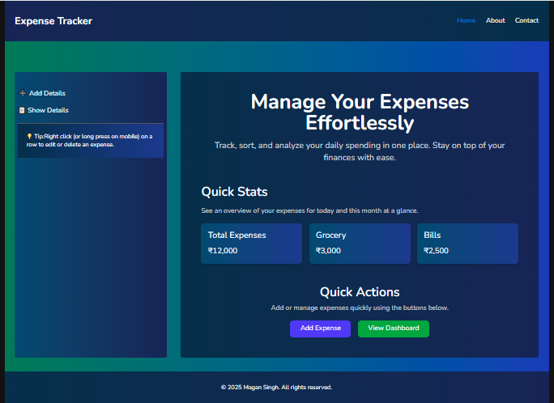
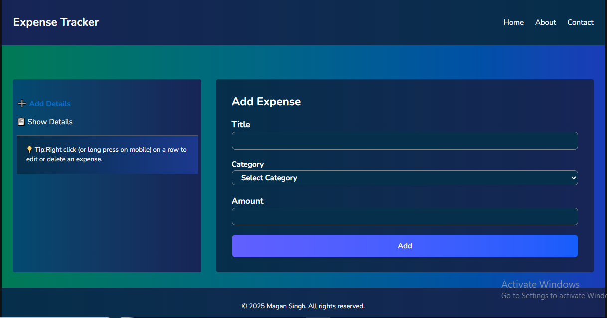
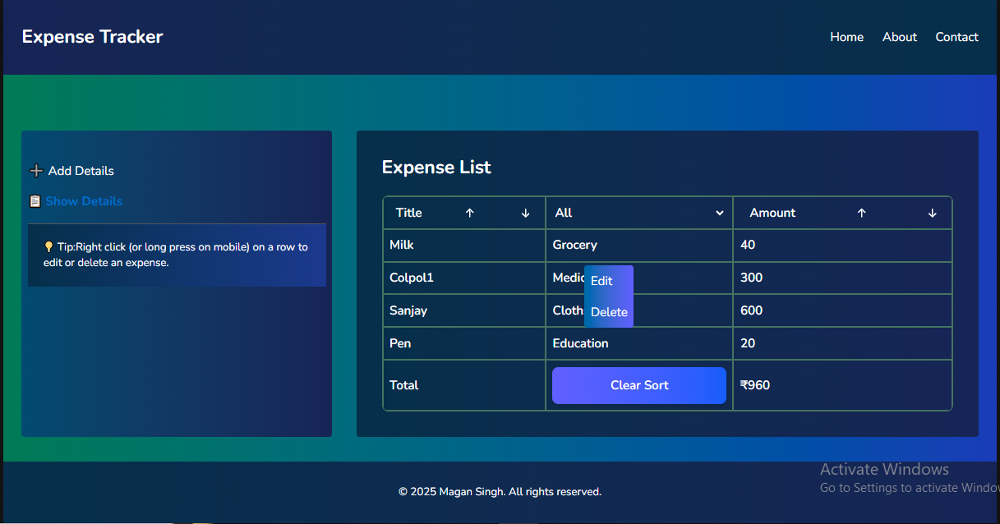
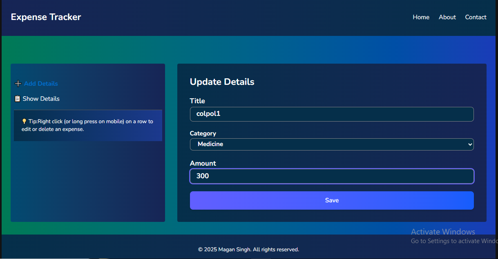
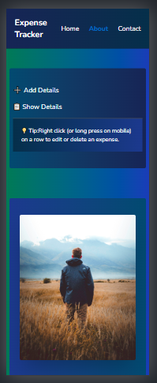
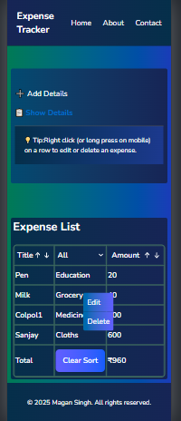
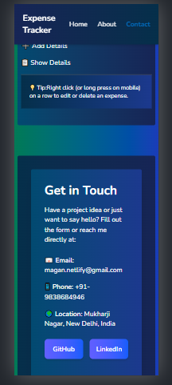

# 💰 MS Trackify – Expense Tracker App

[](https://github.com/theprocoderx/TrackifyApp/stargazers)

A simple and responsive Expense Tracker Application built with React.js (Vite) that helps users add, manage, filter, and track their daily expenses efficiently.

## 🔗 Important Links

🌐 Live Demo: https://mstrackify.netlify.app/
📂 Repository: https://github.com/theprocoderx/TrackifyApp
👨‍💻 Portfolio: https://procoderx.com
🐙 GitHub: https://github.com/theprocoderx
💼 LinkedIn: https://linkedin.com/in/procoderx
📧 Email: procoderxs@gmail.com

---

## 📂 Project Structure

TrackifyApp/
├── node_modules/
├── public/
│ ├── \_redirects
│ └── favicon.webp
├── src/
│ ├── assets/
│ ├── screenshots/
│ ├── components/
│ │ ├── About.jsx
│ │ ├── Contact.jsx
│ │ ├── ContextMenu.jsx
│ │ ├── ExpenseForm.jsx
│ │ ├── ExpenseTable.jsx
│ │ ├── Footer.jsx
│ │ ├── Header.jsx
│ │ ├── Home.jsx
│ │ ├── Input.jsx
│ │ ├── SelectInput.jsx
│ │ └── Sidebar.jsx
│ ├── hooks/
│ │ ├── useFilter.js
│ │ └── useLocalStorage.js
│ ├── App.css
│ ├── App.jsx
│ ├── index.css
│ └── main.jsx
├── .gitignore
├── package.json
├── package-lock.json
├── tailwind.config.js
├── vite.config.js
└── README.md

---

## 🛠️ Tech Stack

- **Frontend:** React.js (Vite)
- **Styling:** Tailwind CSS
- **State & Logic:** Custom React Hooks (`useFilter`, `useLocalStorage`)
- **Storage:** LocalStorage API
- **Code Quality:** ESLint & Prettier

---

## 📸 Screenshots

**Home Page**


**Add Expense**


**Show & Manage Expenses (Edit/Delete via Context Menu)**


**Update Expense**


**About Us in Mobile View**


**Show & Manage Expenses (Edit/Delete via Context Menu) in Mobile View**


**Contact Us in Mobile View**


---

## 🚀 Features

- Quickly add expenses with category, title, and amount
- Manage expenses using edit and delete options
- Filter expenses by category
- Sort data by name or amount with a reset option
- Persist expense data using LocalStorage
- Fully responsive design for desktop, tablet, and mobile devices

---

## ⚙️ Getting Started

### 1. Clone the repository

```bash
git clone https://github.com/theprocoderx/TrackifyApp.git
```

### 2. Navigate to the project folder

```bash
cd TrackifyApp
```

### 3. Install dependencies

```bash
npm install
```

### 4. Start the development server

```bash
npm run dev
```

Open your browser and visit:

```text
http://localhost:5173/home
```

---

## 📜 Version Control

This project is managed using **Git** and **GitHub** with a structured commit history following conventional commit conventions.

**Common commit types:**

- `feat:` – Add a new feature
- `fix:` – Fix bugs
- `refactor:` – Improve code structure without changing functionality
- `style:` – Update UI or code formatting
- `test:` – Add or update tests
- `chore:` – Perform maintenance tasks

---

## 📌 Future Enhancements

- [ ] User Authentication (Firebase/Auth0)
- [ ] Export Expense Data to CSV/PDF
- [ ] Interactive Analytics Dashboard (Recharts)
- [ ] Dark Mode Support

---

## 👨‍💻 Author

**Magan Singh**

Frontend Developer Intern at Namrata Universal (Nov 2025 – Present)

MCA Graduate | React.js | JavaScript | Tailwind CSS
